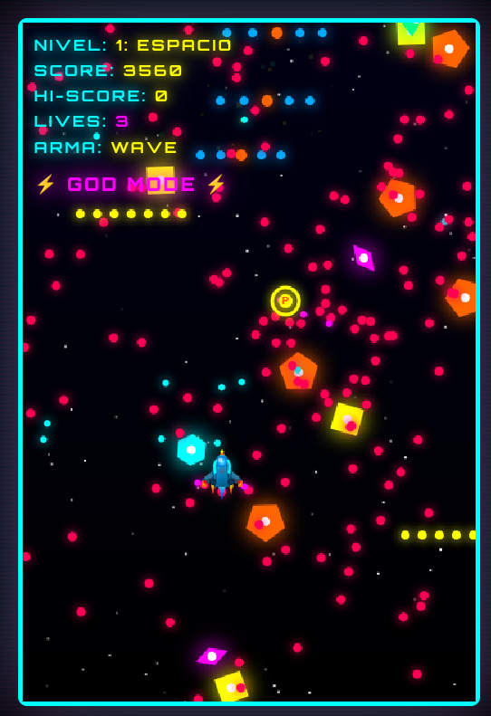
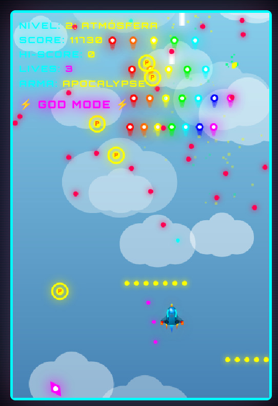
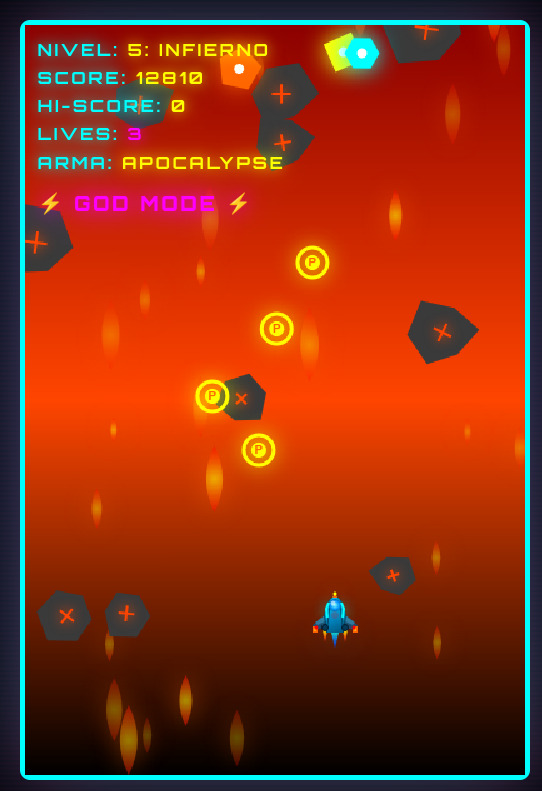

# SSAssault

> **Sistema Sistem Assault** - A bullet hell arcade game built with pure HTML5/CSS3/JavaScript


---

## About

**SSAssault** is a vertical scrolling **bullet hell / shoot'em up** arcade game with a cyberpunk aesthetic. Control your spaceship through 5 thematic levels filled with waves of enemies, devastating bosses, and thousands of projectiles.

**Key Features:**
- 5 unique themed levels (Space, Atmosphere, Surface, Ocean, Inferno)
- 5 epic boss battles with multiple attack phases
- 5 weapon upgrade levels
- 5 enemy types with distinct patterns
- Retro cyberpunk/neon visual style
- High score persistence
- Zero dependencies - runs directly in browser

---

## Screenshots

<p align="center">
  
  
</p>

<p align="center">
  
  
</p>

| Screenshot | Description |
|------------|-------------|
| **01** | Level 1: SPACE - Gameplay with SPREAD weapon |
| **02** | Level 1: SPACE - Intense bullet hell with WAVE weapon |
| **03** | Level 2: ATMOSPHERE - Sky with clouds and APOCALYPSE weapon |
| **04** | Level 5: INFERNO - Fire, lava, and falling rocks |

---

## Play Now

Simply open `ssassault.html` in any modern browser. No installation required!

```bash
# Clone and play
git clone https://github.com/vdirienzo/SSAssault.git
cd SSAssault
# Open ssassault.html in your browser
```

---

## Controls

| Key | Action |
|-----|--------|
| `Arrow Keys` | Move ship |
| `Space` | Fire weapon |
| `P` / `ESC` | Pause / Resume |

### Debug Controls (Development)

| Key | Action |
|-----|--------|
| `1-5` | Skip to level |
| `G` | Toggle God Mode |

---

## Levels

| # | Level | Theme | Boss |
|---|-------|-------|------|
| 1 | **SPACE** | Stars and nebulae | Guardian (10,000 HP) |
| 2 | **ATMOSPHERE** | Clouds and wind | Destroyer (15,000 HP) |
| 3 | **SURFACE** | Rocky terrain, destructible buildings | Annihilator (20,000 HP) |
| 4 | **OCEAN** | Underwater with bubbles and fish | Devastator (25,000 HP) |
| 5 | **INFERNO** | Fire, lava, and burning rocks | Apocalypse (30,000 HP) |

---

## Weapons

Collect power-ups (P) to upgrade your weapon:

| Level | Weapon | Description |
|-------|--------|-------------|
| 1 | **VULCAN** | Single shot |
| 2 | **SPREAD** | Triple shot |
| 3 | **LASER** | Powerful purple/pink beam |
| 4 | **WAVE** | Wave pattern projectiles |
| 5 | **APOCALYPSE** | Pentagonal devastating pattern |

---

## Enemies

| Type | Points | Behavior |
|------|--------|----------|
| **Scout** | 100 | Fast, weak, zigzag movement |
| **Heavy** | 250 | Slow, resistant, circular pattern |
| **Sniper** | 150 | Aimed shots at player |
| **Bomber** | 200 | Launches bullet walls |
| **Assault** | 180 | Fast, spiral pattern |

---

## Technical Stack

```
HTML5 + CSS3 + Vanilla JavaScript
├── Canvas API (2D rendering)
├── LocalStorage API (high score persistence)
├── RequestAnimationFrame (optimized game loop)
└── Google Fonts (Orbitron, Press Start 2P)
```

**File Size:** ~96 KB (single self-contained HTML file)

**Browser Support:** All modern browsers (Chrome, Firefox, Safari, Edge)

---

## Project Structure

```
SSAssault/
├── README.md
├── ssassault.html              # Complete game (HTML + CSS + JS)
└── screenshots/
    ├── 01.jpeg                 # Level 1: Space
    ├── 02.jpeg                 # Level 1: Bullet hell
    ├── 03.jpeg                 # Level 2: Atmosphere
    └── 04.jpeg                 # Level 5: Inferno
```

The entire game is contained in a single HTML file featuring:
- ~240 lines of CSS (cyberpunk styling, animations)
- ~2138 lines of JavaScript (game engine, physics, rendering)

---

## Features Breakdown

### Visual Effects
- Neon glow effects with CSS shadows
- Scanlines (CRT retro effect)
- Particle system for explosions
- Dynamic backgrounds per level
- Parallax scrolling elements

### Boss Mechanics
- Multi-phase battles
- 20+ unique attack patterns:
  - Spiral projectiles
  - Circular explosions
  - Bullet walls
  - Aimed shots
  - Cross patterns
  - Double spirals

### Game Systems
- Collision detection (player, enemies, bullets)
- Procedural enemy spawning
- Power-up collection system
- Lives and scoring system
- Pause functionality

---

## Development

### Running Locally

No build process required:

```bash
# Option 1: Open directly
open ssassault.html

# Option 2: Simple HTTP server (Python)
python3 -m http.server 8080
# Visit http://localhost:8080/ssassault.html

# Option 3: Live Server (VS Code extension)
# Right-click ssassault.html > "Open with Live Server"
```

### Code Architecture

```javascript
// Main components
class Enemy { }     // 5 enemy types with unique patterns
class Boss { }      // 5 bosses with multiple attack phases

// Core systems
gameLoop()          // RequestAnimationFrame loop
updatePlayer()      // Movement and shooting
checkCollisions()   // Hit detection
drawBackground()    // Level-specific rendering
```

---

## Roadmap

Potential future enhancements:
- [ ] Mobile touch controls
- [ ] Sound effects and music
- [ ] Additional levels
- [ ] Local multiplayer
- [ ] Online leaderboard
- [ ] Save/load game state

---

## Credits

- **Fonts:** [Google Fonts](https://fonts.google.com/) - Orbitron, Press Start 2P
- **Inspiration:** Classic bullet hell games (Touhou, Ikaruga, DoDonPachi)

---

## License

MIT License - Feel free to use, modify, and distribute.

---

## Author

Created with passion for arcade gaming and web technologies.

---

**Enjoy the chaos!**
